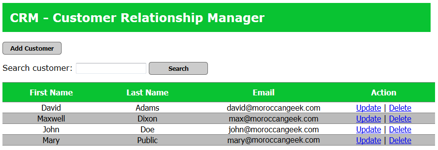

# CRM-Customer Relationship Manager
> A basic CRUD App using Spring Framework for backend development

A simple project for Spring Framework beginners, where you can Create, Read, Update, or Delete from your database. In addition, as a plus feature, you can search for a customer.

## Getting Started

### Prerequisites

1 - Must Install Maven, or if you're using Eclipse JEE IDE, make sure that m2e plugin is installed.

2 - Check SQL scripts to create the Database.

## Built With

* [Spring 5](https://spring.io/projects/spring-framework) - including Spring MVC, Spring Core, Spring AOP
* [Maven](https://maven.apache.org/) - Dependency Management
* [Hibernate ORM](http://hibernate.org/orm/) - Object/Relational Mapping
* [Eclipse](https://www.eclipse.org/) - JAVA IDE
* [MySQL](https://www.mysql.com/) - Relational Database Management System
